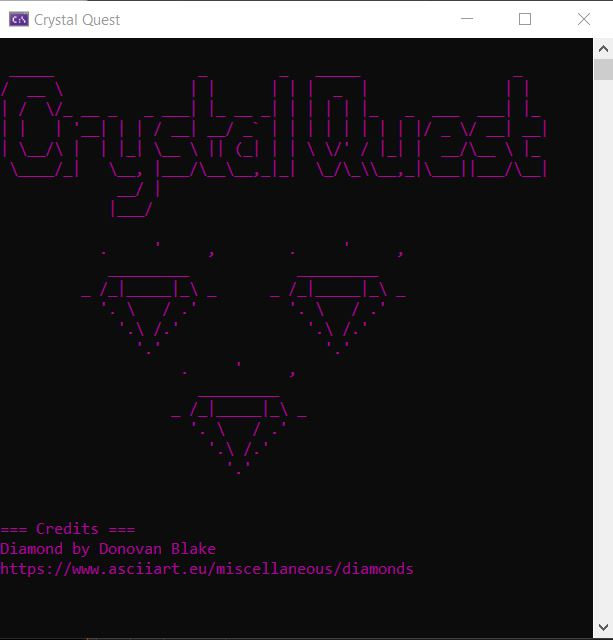

# Programming Portfolio

## Adventure Game

An Adventure Game that demonstrates object-oriented programming principles inheritance, encapsulation, and polymorphism. In the game the player is able to play an Introducion level and a part of level one. The player receives a letter from their friend named Andrew, who lost four magical crystals, they player is tasked with thraveling the world and locating these four crystals.

## Study Application

A Study Application that reads reads in terms and definitions from an external files. This study application teachers the user 15 terms in C#.

## Explorable Areas

Explorable Areas is a group assignment worked on by Eden Szopa and Dana Campos, it is a command-line application with areas to explore and items for the player to find in each area. The player is only able to travel to different areas after finding the required equipment.

## Underwater Creatures

Underwater Creatures is a group assignment worked on by Eden Szopa, Dana Campos, Emily Loera, and Christopher Rodriguez. The application demonstrates inheritance, polymorphism, and encapsulation.

## Adopt-An-Insect

An application that lets the player create a custom insect character and adopt the insect.

## Shift Cipher

Shift Cipher is a group assignment worked on by Eden Szopa, and Dana Campos. Shift Cipher is a application that encodes and decodes using a simple substitutuion cipher. 

## Trivia Game

Trivia Game is a Harry Potter Trivia Game where the player can choose one of the four Hogwarts Houses and answer questions relating to the Hogwarts House of their choice.

